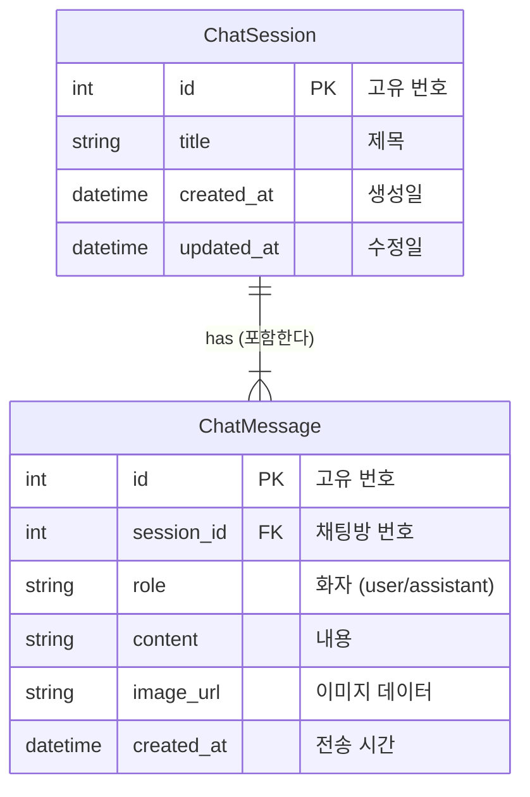

# 🗄️ 데이터베이스 구조 문서 (Database Schema)

이 문서는 VLM Chatbot 프로젝트에서 사용되는 **데이터베이스(SQLite)**의 구조를 설명합니다.  
개발자가 아닌 분들도 이해할 수 있도록 쉽게 작성되었습니다.

---

## 📌 개요

우리는 **두 개의 테이블**을 사용하여 채팅 데이터를 관리합니다.
1. **ChatSession**: 채팅방 (카톡의 단톡방 개념)
2. **ChatMessage**: 채팅방 안의 메시지들 (말풍선)

이 둘은 **1:N (일대다) 관계**입니다.
> 하나의 채팅방(`ChatSession`)에는 여러 개의 메시지(`ChatMessage`)가 들어갈 수 있습니다.

---

## 1. ChatSession (채팅방)

사용자가 "새로운 채팅"을 시작할 때마다 하나씩 생성되는 **채팅방 정보**입니다.

| 필드명 (Column) | 타입 | 설명 | 예시 |
| :--- | :--- | :--- | :--- |
| **id** | `Integer` | **(PK)** 채팅방의 고유 번호 | `1`, `2`, `10` |
| **title** | `String` | 채팅방 제목 (첫 메시지 내용을 따옴) | `"이 사진 위험해 보여?"` |
| **created_at** | `DateTime` | 채팅방이 처음 만들어진 시간 | `2024-01-11 14:00:00` |
| **updated_at** | `DateTime` | 마지막으로 대화가 오간 시간 | `2024-01-11 14:05:30` |

> **참고**: 채팅방 목록을 보여줄 때는 `updated_at`을 기준으로 최신순 정렬합니다.

---

## 2. ChatMessage (메시지)

채팅방 안에서 오고 간 **대화 내용(말풍선)**들입니다.

| 필드명 (Column) | 타입 | 설명 | 예시 |
| :--- | :--- | :--- | :--- |
| **id** | `Integer` | **(PK)** 메시지의 고유 번호 | `101`, `102` |
| **session_id** | `Integer` | **(FK)** 어떤 채팅방의 메시지인지 연결 | `1` (1번 채팅방 소속) |
| **role** | `String` | 누가 말했는지 (`user`: 사용자, `assistant`: AI) | `"user"` |
| **content** | `Text` | 메시지 내용 (텍스트) | `"안전모 착용했나요?"` |
| **image_url** | `Text` | 첨부한 이미지 (Base64 코드로 저장됨) | `data:image/jpeg;base64...` |
| **created_at** | `DateTime` | 메시지가 전송된 시간 | `2024-01-11 14:02:00` |

---

## 🔗 관계 다이어그램 (ERD)

---

## 💡 주요 동작 원리

1. **채팅방 생성**: 
   - 사용자가 첫 메시지를 보내면 `ChatSession`이 먼저 만들어집니다.
   - 제목(`title`)은 사용자의 첫 메시지 앞부분을 따서 자동으로 지어집니다.

2. **메시지 저장**:
   - 사용자의 질문(`user`)이 `ChatMessage` 테이블에 저장됩니다.
   - AI의 답변(`assistant`)도 `ChatMessage` 테이블에 저장됩니다.
   - 이때 두 메시지 모두 `session_id`에 방금 만든 채팅방 번호가 적힙니다.

3. **삭제 (Cascade Delete)**:
   - 만약 1번 채팅방(`ChatSession`)을 삭제하면?
   - 1번 방에 연결된 모든 메시지(`ChatMessage` 중 `session_id`가 1인 것들)도 **자동으로 함께 삭제**됩니다. (찌꺼기가 남지 않아요!)
