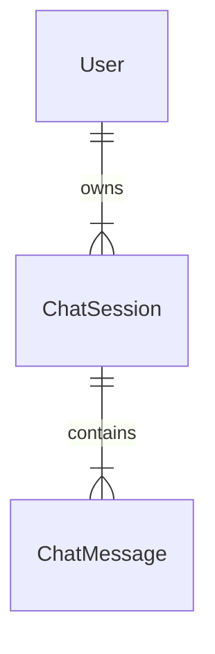

# ⚙️ VLM Chatbot 시스템 설계서 (System Design)

이 문서는 VLM Safety Chatbot의 전체 아키텍처와 데이터베이스 구조를 정의합니다.

---

## 1. 시스템 아키텍처 (Architecture)

### 1.1. 전체 구성도
```
┌──────────────────┐      ┌─────────────────────────────┐      ┌──────────────────┐
│     사용자       │      │      메인 서버 (API)         │      │     GPU 서버     │
│    (Browser)     │ ───▶ │   (FastAPI + SQLite)        │ ───▶ │      (vLLM)      │
└──────────────────┘      └─────────────────────────────┘      └──────────────────┘
```

*   **Frontend**: React + Vite 기반의 SPA. 스트리밍 UI 및 최적화된 렌더링 제공.
*   **Backend**: FastAPI 비동기 서버. 비동기 추론 및 효율적인 DB 커넥션 관리.
*   **AI Model**: vLLM 엔진을 통한 Qwen3-VL-8B-Instruct 모델 서빙.

---

## 2. 데이터베이스 구조 (Database Schema)

SQLite를 사용하며, 사용자 인증 및 채팅 관리를 위한 3개의 핵심 테이블로 구성됩니다.

### 2.1. 테이블 명세

#### User (사용자)
| 필드명 | 타입 | 설명 |
| :--- | :--- | :--- |
| **id** | Integer (PK) | 사용자 고유 ID |
| **email** | String (Unique) | 로그인 아이디 |
| **hashed_password** | String | 암호화된 비밀번호 |
| **username** | String | 표시용 이름 |

#### ChatSession (채팅방)
| 필드명 | 타입 | 설명 |
| :--- | :--- | :--- |
| **id** | Integer (PK) | 채팅방 고유 ID |
| **user_id** | Integer (FK) | 소유 사용자 ID |
| **title** | String | 채팅방 제목 |
| **updated_at** | DateTime | 마지막 활동 시간 |

#### ChatMessage (메시지)
| 필드명 | 타입 | 설명 |
| :--- | :--- | :--- |
| **id** | Integer (PK) | 메시지 고유 ID |
| **session_id** | Integer (FK) | 소속 채팅방 ID |
| **role** | String | 화자 (user / assistant) |
| **content** | Text | 대화 내용 |
| **image_url** | Text | 첨부 파일 메타데이터 (JSON) |

### 2.2. 관계도 (ERD)


---

## 3. 핵심 아키텍처 특징
*   **Asynchronous Processing**: 모든 외부 API 호출 및 DB 작업이 비동기로 처리되어 높은 동시성을 보장합니다.
*   **DB Resource Management**: 스트리밍 중에는 DB 세션을 즉시 반납하여 리소스 잠금을 방지합니다.
*   **WAL Mode**: SQLite의 Write-Ahead Logging을 활성화하여 읽기/쓰기 성능을 극대화했습니다.
